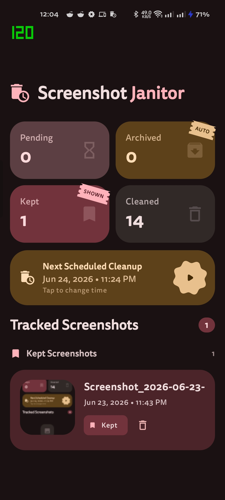
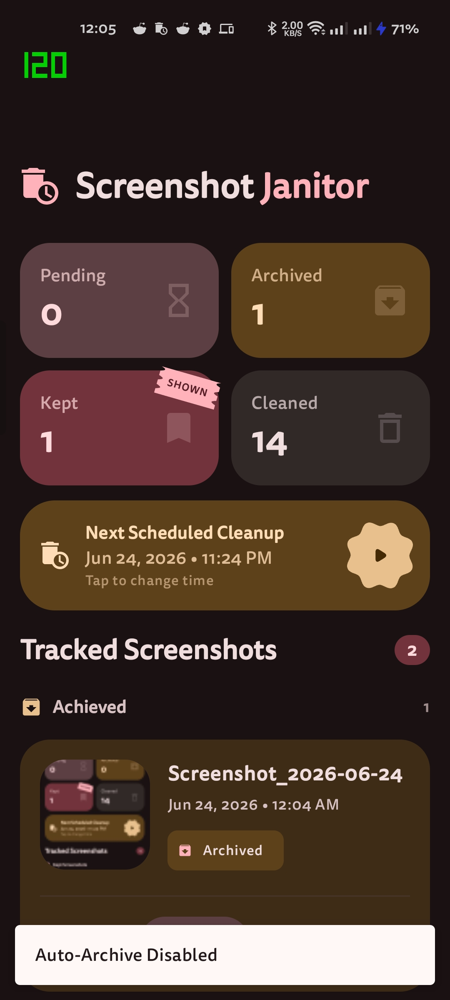
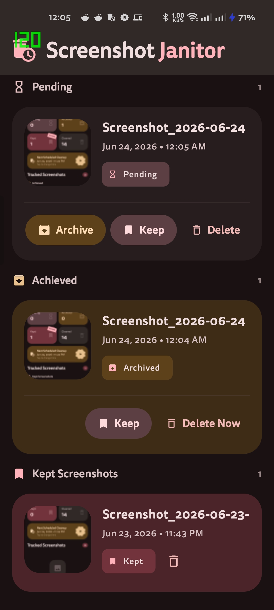
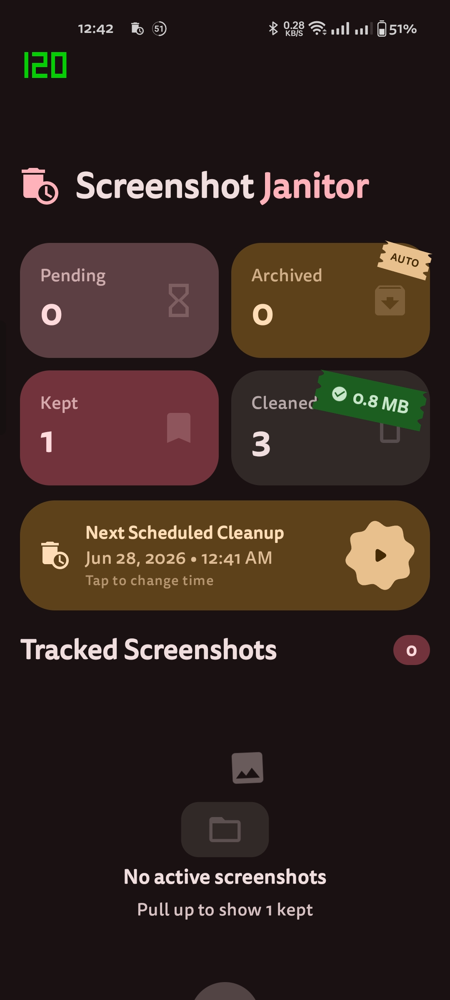
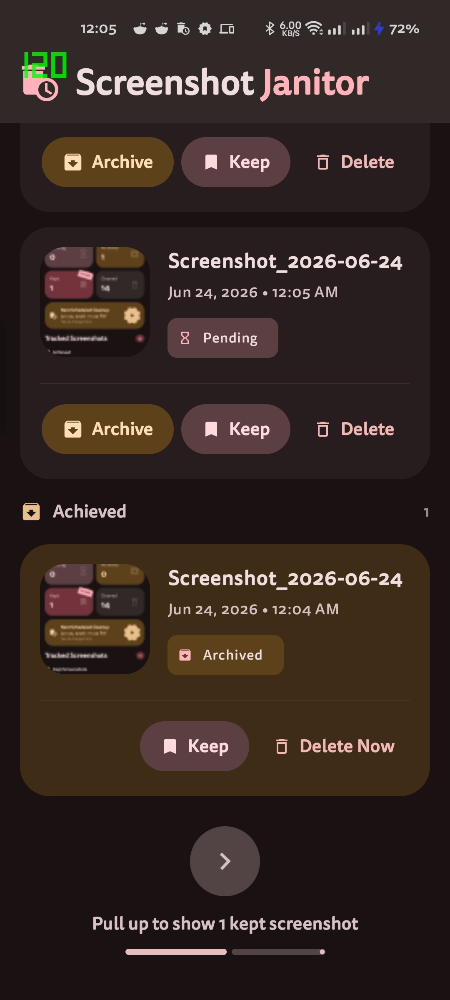

<div align="center">
  
  <h1>ssJanitor</h1>
  <p>Minimal Android 14+ screenshot management utility</p>
  <p>
    <strong>Kotlin</strong> · <strong>Jetpack Compose</strong> · <strong>Material 3</strong>
  </p>
  <p>
    <a href="#install">Install</a> ·
    <a href="#features">Features</a> ·
    <a href="#tech-stack">Tech Stack</a> ·
    <a href="#getting-started">Getting Started</a> ·
    <a href="#permissions">Permissions</a> ·
    <a href="docs/architecture.md">Architecture</a>
  </p>
</div>

---

ssJanitor monitors newly created screenshots, lets you archive or delete them through lightweight notifications, and automatically cleans up unarchived screenshots on a schedule. Intentionally lightweight, battery-friendly, and aligned with modern Android storage and background execution policies.

## Install

| | Source |
|---|---|
| [](https://github.com/ShubhamJ010/ScreenshotJanitor/releases/latest) | GitHub Releases |
| [](https://apps.obtainium.imranr.dev/redirect?r=obtainium://app/%7B%22id%22%3A%22dev.sj010.ssjanitor%22%2C%22url%22%3A%22https%3A%2F%2Fgithub.com%2FShubhamJ010%2FScreenshotJanitor%22%2C%22author%22%3A%22ShubhamJ010%22%2C%22name%22%3A%22ssJanitor%22%2C%22preferredApkIndex%22%3A0%2C%22additionalSettings%22%3A%22%7B%5C%22includePrereleases%5C%22%3Atrue%2C%5C%22fallbackToOlderReleases%5C%22%3Atrue%2C%5C%22filterReleaseTitlesByRegEx%5C%22%3A%5C%22%5C%22%2C%5C%22filterReleaseNotesByRegEx%5C%22%3A%5C%22%5C%22%2C%5C%22verifyLatestTag%5C%22%3Afalse%2C%5C%22sortMethodChoice%5C%22%3A%5C%22date%5C%22%2C%5C%22useLatestAssetDateAsReleaseDate%5C%22%3Afalse%2C%5C%22releaseTitleAsVersion%5C%22%3Afalse%2C%5C%22trackOnly%5C%22%3Afalse%2C%5C%22versionExtractionRegEx%5C%22%3A%5C%22%5C%22%2C%5C%22matchGroupToUse%5C%22%3A%5C%22%5C%22%2C%5C%22versionDetection%5C%22%3Atrue%2C%5C%22releaseDateAsVersion%5C%22%3Afalse%2C%5C%22useVersionCodeAsOSVersion%5C%22%3Afalse%2C%5C%22apkFilterRegEx%5C%22%3A%5C%22%5C%22%2C%5C%22invertAPKFilter%5C%22%3Afalse%2C%5C%22autoApkFilterByArch%5C%22%3Atrue%2C%5C%22appName%5C%22%3A%5C%22%5C%22%2C%5C%22appAuthor%5C%22%3A%5C%22%5C%22%2C%5C%22shizukuPretendToBeGooglePlay%5C%22%3Afalse%2C%5C%22allowInsecure%5C%22%3Afalse%2C%5C%22exemptFromBackgroundUpdates%5C%22%3Afalse%2C%5C%22skipUpdateNotifications%5C%22%3Afalse%2C%5C%22about%5C%22%3A%5C%22%5C%22%2C%5C%22refreshBeforeDownload%5C%22%3Afalse%2C%5C%22includeZips%5C%22%3Afalse%2C%5C%22zippedApkFilterRegEx%5C%22%3A%5C%22%5C%22%7D%22%2C%22overrideSource%22%3Anull%7D) | One-tap install via Obtainium |
| [](https://apt.izzysoft.org/fdroid/apk/dev.sj010.ssjanitor) | F-Droid repo by IzzyOnDroid |
| [](#f-droid) | *TODO — pending publication* |

## Screenshots

<table>
  <tr>
    <td></td>
    <td></td>
    <td></td>
  </tr>
  <tr>
    <td></td>
    <td></td>
    <td></td>
  </tr>
</table>

## Features

- **Screenshot Detection** — URI-based detection via MediaStore ContentObserver with cold-start initial scan, exponential-backoff retry, `IS_PENDING` column filtering, and fallback scan for edge cases.
- **Action Notifications** — Archive, Keep, or Delete from a dismissible notification.
- **Auto-Archive Mode** — Long-press the Archived card to auto-archive every new screenshot by default.
- **Battery Optimization Opt-Out** — Dedicated card with one-tap "Battery Usage" button to disable battery optimization.
- **Automatic Cleanup** — WorkManager-based daily cleanup removes archived screenshots.

[Detailed feature docs →](docs/features.md)

## Tech Stack

| Layer | Technology |
|---|---|
| Language | Kotlin |
| UI | Jetpack Compose + Material 3 Expressive |
| Local Database | Room |
| Background Tasks | WorkManager |
| Storage APIs | MediaStore |
| Notifications | NotificationCompat |
| Architecture | MVVM-lite |

## Getting Started

1. Open the project in Android Studio.
2. Sync Gradle (uses version catalog at `gradle/libs.versions.toml`).
3. Build and run on a device running **Android 14+** (min SDK 34).

No API keys, no cloud services, no configuration required.

## Permissions

```xml
<uses-permission android:name="android.permission.READ_MEDIA_IMAGES" />
<uses-permission android:name="android.permission.POST_NOTIFICATIONS" />
<uses-permission android:name="android.permission.MANAGE_EXTERNAL_STORAGE" />
<uses-permission android:name="android.permission.REQUEST_IGNORE_BATTERY_OPTIMIZATIONS" />
```

- `READ_MEDIA_IMAGES` — Required to query screenshots from MediaStore.
- `POST_NOTIFICATIONS` — Required for screenshot action notifications.
- `MANAGE_EXTERNAL_STORAGE` — Required for batch deletion of archived screenshots.
- `REQUEST_IGNORE_BATTERY_OPTIMIZATIONS` — Required to opt out of battery optimization for reliable background detection.

## Project Structure

```
app/src/main/java/dev/sj010/ssjanitor/
├── core/              — Constants, extensions, utils
├── data/              — Room DB, DAO, entities, repositories
├── notifications/     — Notification manager & action receiver
├── observer/          — ContentObserver & screenshot detection
├── ui/                — Compose screens, components, theme
├── viewmodel/         — ViewModels
├── worker/            — WorkManager cleanup worker
├── MainActivity.kt
└── SsJanitorApp.kt
```

## Documentation

| Document | Description |
|---|---|
| [Architecture](docs/architecture.md) | MVVM layers, process flows, component details |
| [Features](docs/features.md) | Detailed feature descriptions |
| [Database Schema](docs/database.md) | Room entities, DAO, repository |
| [Notifications](docs/notifications.md) | Notification flow & action handling |
| [Cleanup Worker](docs/cleanup.md) | WorkManager-based cleanup pipeline |
| [Resource Usage](docs/resource-usage.md) | Foreground / background CPU, memory, and battery profiling |
| [Development](docs/development.md) | Principles, design goals, MVP scope, future ideas |
| [Changelog](CHANGELOG.md) | Release history |

## License

[MIT](LICENSE)
