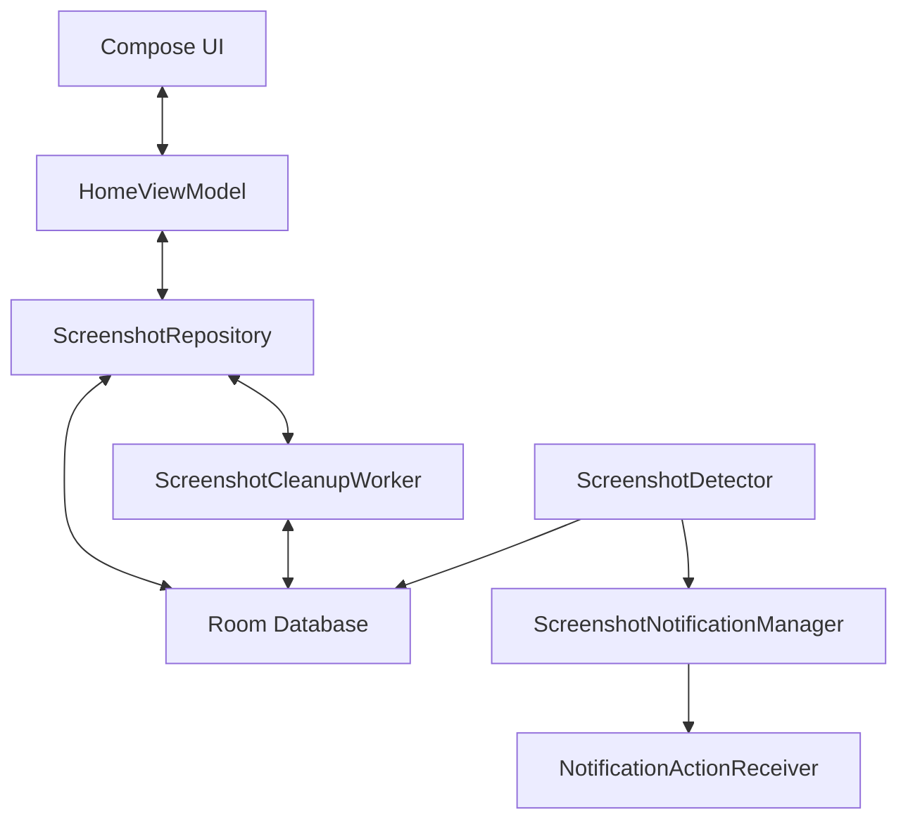

# Architecture

ssJanitor follows **MVVM-lite** — a lightweight Model-View-ViewModel pattern without heavy DI frameworks.

## Diagram

## Layers

### Presentation
- **Jetpack Compose** — Entire UI built with Compose + Material 3 Expressive.
- **HomeViewModel** — Manages home screen state, streams screenshots from repository.

### Data
- **Room Database** — Source of truth for screenshot metadata (`ScreenshotEntity`).
- **ScreenshotRepository** — Orchestrates Room ↔ MediaStore; handles reconciliation, deletion requests, status updates.
- **SettingsRepository** — Manages preferences (auto-archive toggle) via DataStore.

### Background & System
- **ScreenshotDetector** — `ContentObserver` registered on `MediaStore.Images.Media.EXTERNAL_CONTENT_URI`. Filters new images by screenshot naming conventions.
- **ScreenshotNotificationManager** — Creates notifications with action buttons.
- **NotificationActionReceiver** — `BroadcastReceiver` handling Keep/Archive/Delete actions.
- **ScreenshotCleanupWorker** — Periodic `WorkManager` task deleting archived screenshots.

## Key Processes

### Screenshot Detection
1. `ContentObserver` detects a MediaStore change.
2. Queries the latest image and checks if it's a screenshot (name/path heuristics).
3. Records the entry in Room.
4. Shows a notification with Archive/Keep/Delete actions.

### Cleanup
1. `WorkManager` triggers the daily worker.
2. Queries Room for `archived = true AND deleted = false`.
3. Attempts Scoped Storage-compatible deletion.
4. Updates database on success.

### Data Reconciliation
- Periodically checks if files in the DB still exist in MediaStore.
- Marks externally-deleted files as `deleted` to keep state consistent.

## Design Goals

- Tiny APK size
- Minimal memory usage
- Battery efficient — no polling, no foreground services
- Android-native behavior
- No cloud, no analytics, no accounts
