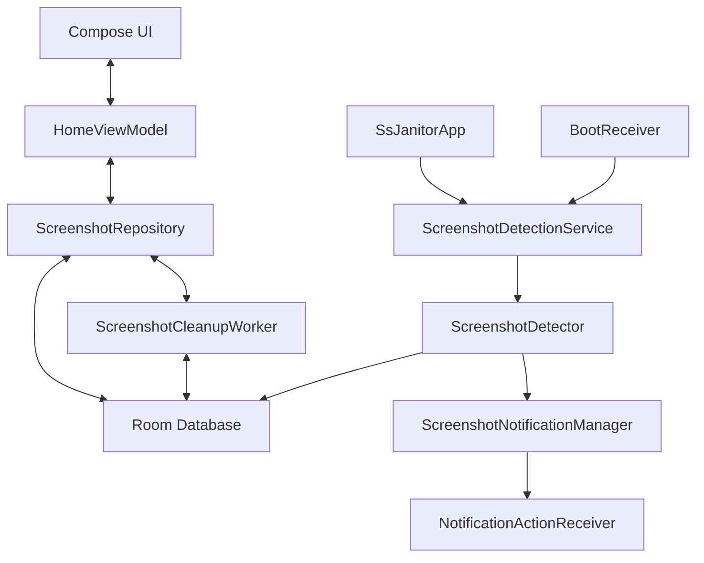

# Architecture

ssJanitor follows **MVVM-lite** — a lightweight Model-View-ViewModel pattern without heavy DI frameworks.

## Diagram

## Layers

### Presentation
- **Jetpack Compose** — Entire UI built with Compose + Material 3 Expressive.
- **HomeViewModel** — Manages home screen state, streams screenshots from repository.

### Data
- **Room Database** — Source of truth for screenshot metadata (`ScreenshotEntity`).
- **ScreenshotRepository** — Orchestrates Room ↔ MediaStore; handles reconciliation, deletion requests, status updates.
- **SettingsRepository** — Manages preferences (auto-archive toggle) via DataStore.

### Background & System
- **SsJanitorApp** — Application class holding shared references (database, repository, contentObserver) initialized via `by lazy` for thread safety.
- **ScreenshotDetectionService** — Foreground service that hosts `ScreenshotDetector`, keeping the process alive for reliable MediaStore observation.
- **BootReceiver** — `BroadcastReceiver` for `BOOT_COMPLETED` that restarts the detection service after device reboot.
- **ScreenshotDetector** — Wraps `ScreenshotContentObserver`, registered on `MediaStore.Images.Media.EXTERNAL_CONTENT_URI`. Filters new images by screenshot naming conventions.
- **ScreenshotContentObserver** — URI-based detection with `IS_PENDING` column filtering, exponential-backoff retry (~10.3s window), `performInitialScan()` on cold start, and `scanLatestScreenshots()` fallback for edge cases.
- **ScreenshotNotificationManager** — Creates notifications with action buttons.
- **NotificationActionReceiver** — `BroadcastReceiver` handling Keep/Archive/Delete actions with proper `goAsync()` lifecycle.
- **ScreenshotCleanupWorker** — Periodic `WorkManager` task deleting archived screenshots.

## Key Processes

### Screenshot Detection
1. `BootReceiver` restarts `ScreenshotDetectionService` after device boot.
2. `ScreenshotDetectionService` starts as a foreground service and registers `ScreenshotContentObserver`.
3. `performInitialScan()` immediately scans the last 30 seconds of MediaStore to catch screenshots taken during the app startup window.
4. On a MediaStore change, the observer queries by content URI ID (not latest-image scan) with `IS_PENDING` and blank-column checks.
5. If the URI row is not yet indexed by MediaStore (cold-start race), retries with exponential backoff (200ms → 2s × 3) for up to ~10.3s.
6. If URI-based retries are exhausted, falls back to `scanLatestScreenshots()` (last 60 seconds).
7. On successful detection, calls `handleNewScreenshot` (suspend function) to insert into Room and show a notification.
8. URI deduplication is managed via synchronized sets with 200-entry cap and oldest-25% eviction.

### Cleanup
1. `WorkManager` triggers the daily worker.
2. Queries Room for `archived = true AND deleted = false`.
3. Attempts Scoped Storage-compatible deletion.
4. Updates database on success.

### Data Reconciliation
- Periodically checks if files in the DB still exist in MediaStore.
- Marks externally-deleted files as `deleted` to keep state consistent.

## Design Goals

- Tiny APK size
- Minimal memory usage
- Battery efficient — no polling, foreground service uses minimal uptime
- Android-native behavior
- No cloud, no analytics, no accounts
