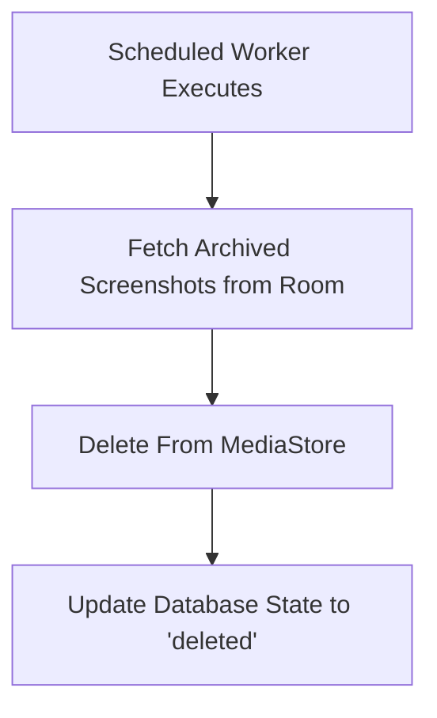

# Cleanup Worker

## Flow

## Implementation

**File:** `worker/ScreenshotCleanupWorker.kt`

Powered by WorkManager for battery-efficient background execution.

| Aspect | Detail |
|---|---|
| Schedule | Periodic (daily) |
| API | `WorkManager.enqueueUniquePeriodicWork` |
| Retry | Exponential backoff for failed deletions |
| Scoped Storage | Uses Android 10+ deletion APIs |

## Behavior

1. WorkManager triggers the worker on its scheduled interval.
2. The worker queries `ScreenshotRepository` for entries where `archived = true` and `deleted = false`.
3. For each match, it attempts to delete the file from MediaStore.
4. On success, the database row is marked `deleted = true`.
5. Failed deletions are retried on the next scheduled run.
6. Old unarchived screenshots beyond a retention period trigger a cleanup recommendation notification.
