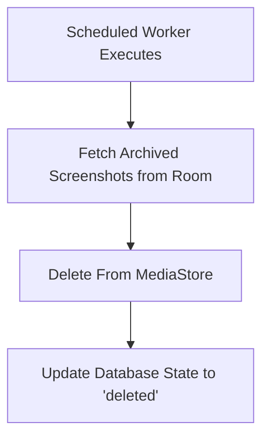

# Cleanup Worker

## Flow

```mermaid
flowchart TD
    A[Scheduled Worker Executes] --> B[Fetch Archived Screenshots from Room]
    B --> C[Delete From MediaStore]
    C --> D[Update Database State to 'deleted']
```

## Implementation

**File:** `worker/ScreenshotCleanupWorker.kt`

Powered by WorkManager for battery-efficient background execution.

| Aspect | Detail |
|---|---|
| Schedule | Periodic (daily) |
| API | `WorkManager.enqueueUniquePeriodicWork` |
| Retry | Exponential backoff for failed deletions |
| Scoped Storage | Uses Android 10+ deletion APIs |

## Behavior

1. WorkManager triggers the worker on its scheduled interval.
2. The worker queries `ScreenshotRepository` for entries where `archived = true` and `deleted = false`.
3. For each match, it attempts to delete the file from MediaStore.
4. On success, the database row is marked `deleted = true`.
5. Failed deletions are retried on the next scheduled run.
6. Old unarchived screenshots beyond a retention period trigger a cleanup recommendation notification.

## Pre-Cleanup Heads-Up Reminder

To give the user a chance to review before anything is deleted, a second unique
periodic work (`CleanupReminderWorker`, name `ScreenshotCleanupReminderWork`) is
scheduled alongside the cleanup work. It fires `PRE_CLEANUP_REMINDER_MINUTES`
(30) minutes **before** the scheduled cleanup, every day.

- Only notifies when there are archived screenshots actually pending deletion
  (mirrors the cleanup worker's no-op-when-empty behavior).
- Uses a dedicated **high-importance** notification channel
  (`ssjanitor_reminder_channel`) with `PRIORITY_MAX` so it appears as a heads-up
  (peek) notification. It still respects Do Not Disturb.
- Offers **Review** (open the app) and **Clean up now** actions.

Both works are scheduled by `worker/CleanupScheduler.kt` from a single base delay
so they stay aligned across reschedules and reboots. The default cleanup time is
**11:30 PM in the device's local timezone** (overridable via the schedule UI,
persisted in `SettingsRepository`).
