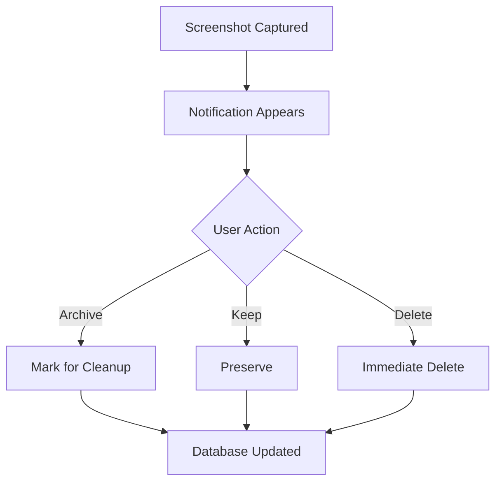

# Notifications

## Flow

## Implementation

| Component | File | Role |
|---|---|---|
| Notification Manager | `notifications/ScreenshotNotificationManager.kt` | Creates and displays notifications with action buttons |
| Action Receiver | `notifications/NotificationActionReceiver.kt` | Handles user tap on notification actions, updates DB |

## Notification Behavior

- **Heads-up notification** — appears prominently when a new screenshot is detected.
- **Dismissible** — swiping away the notification does not affect the screenshot.
- **Auto-Archive mode** — when enabled, notification offers "Keep" and "Delete Now" instead of "Archive" and "Keep".

## Channels

A dedicated notification channel is configured during app initialization for screenshot alerts.
