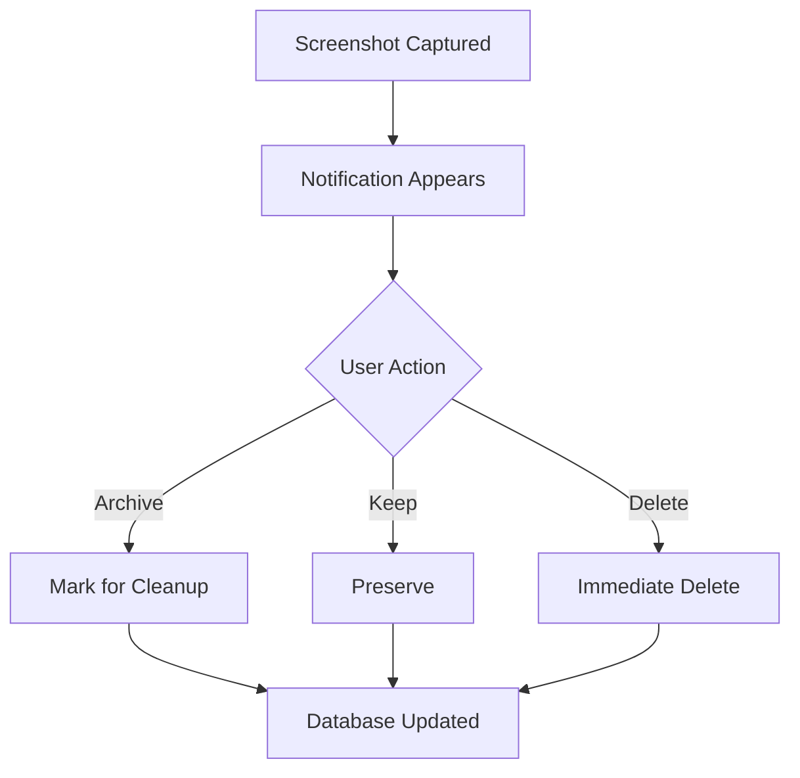

# Notifications

## Flow

```mermaid
flowchart TD
    A[Screenshot Captured] --> B[Notification Appears]
    B --> C{User Action}
    C -->|Archive| D[Mark for Cleanup]
    C -->|Keep| E[Preserve]
    C -->|Delete| F[Immediate Delete]
    D --> G[Database Updated]
    E --> G
    F --> G
```

## Implementation

| Component | File | Role |
|---|---|---|
| Notification Manager | `notifications/ScreenshotNotificationManager.kt` | Creates and displays notifications with action buttons |
| Action Receiver | `notifications/NotificationActionReceiver.kt` | Handles user tap on notification actions, updates DB |

## Notification Behavior

- **Heads-up notification** — appears prominently when a new screenshot is detected.
- **Dismissible** — swiping away the notification does not affect the screenshot.
- **Auto-Archive mode** — when enabled, notification offers "Keep" and "Delete Now" instead of "Archive" and "Keep".

## Channels

Two notification channels are configured during app initialization:

| Channel | Importance | Purpose |
|---|---|---|
| `ssjanitor_channel` (Screenshot Detection) | DEFAULT | New-screenshot alerts with Keep/Archive/Delete actions |
| `ssjanitor_service_channel` (Background Detection) | LOW | Ongoing foreground detection service |
| `ssjanitor_reminder_channel` (Cleanup Reminder) | **HIGH** | Pre-cleanup heads-up warning, 30 min before scheduled cleanup |

The **Cleanup Reminder** channel is `IMPORTANCE_HIGH` so the "Janitor is on the way"
warning reliably appears as a heads-up (peek) notification with `PRIORITY_MAX`.
It respects the device's Do Not Disturb settings.
